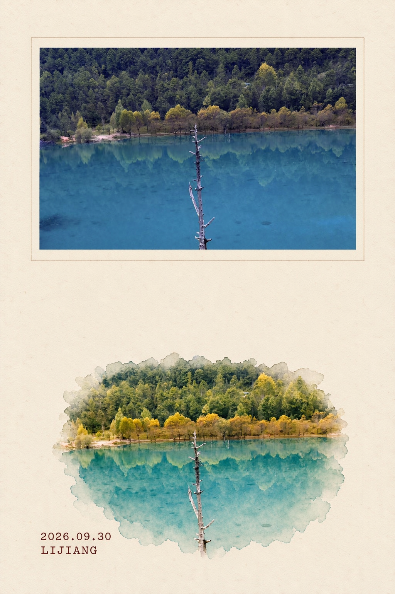
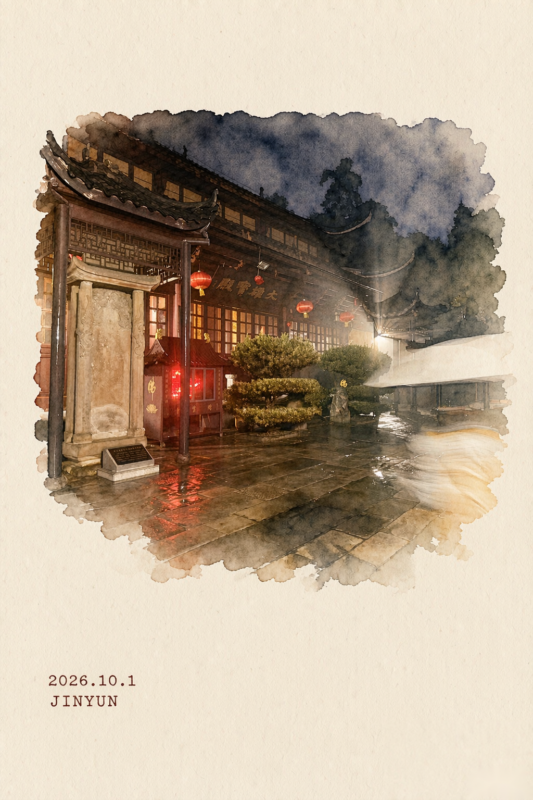
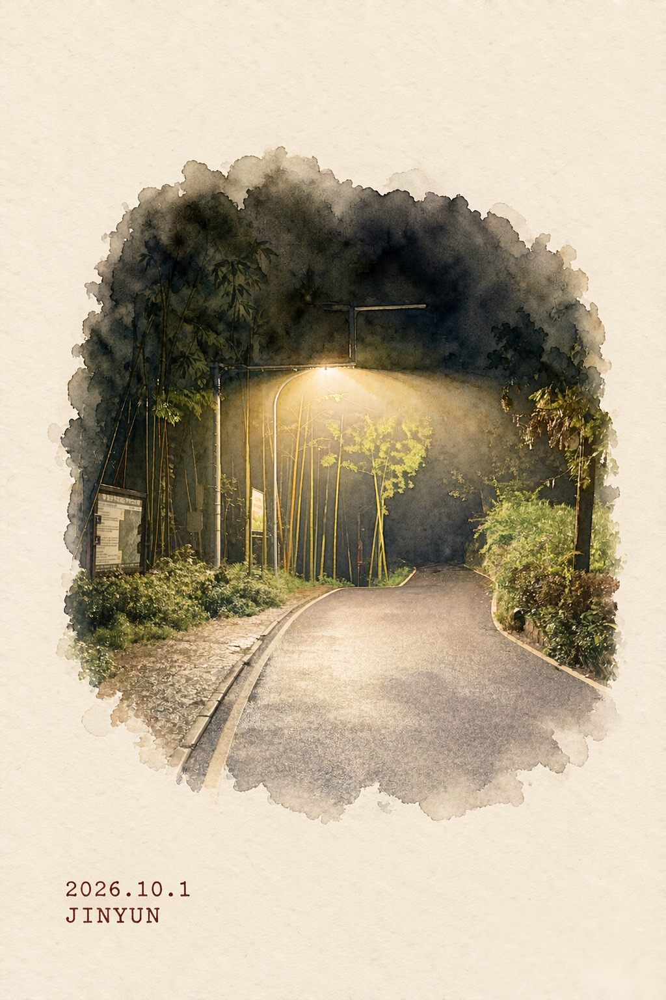

# Photo to Zine Watercolor

**中文** · [English](README_EN.md)

把旅行照片转换成一套极简、留白充足、水彩手绘感的 Zine 风格卡片——支持两种模式，已在 17 张真实照片上完整验证。

这个仓库提供一份可直接复用的 [`SKILL.md`](SKILL.md)，用于指导 AI 编程/设计助手（Claude Code、Codex、WorkBuddy 等）执行整套工作流。

## 两种输出模式

| 模式 | 结构 | 适合 |
|---|---|---|
| **A · 明信片正面** | 上方原照片横幅（细框嵌入）+ 下方水彩主景 + 打字机日期地名 | 想保留照片纪实感的旅拍 |
| **B · 纯水彩页** | 整页米白纸 + 中央水彩主景 + 打字机日期地名，无照片 | 只要手绘氛围、做 zine 内页 |

## 效果示例

| 模式 A · 丽江蓝月谷 | 模式 B · 缙云山古寺 | 模式 B · 缙云山夜径 |
|---|---|---|
|  |  |  |

## 快速开始

1. 把本仓库（或单独的 `SKILL.md`）提供给你的 AI 助手。
2. 上传一张或一批你拍的照片。
3. 输入：

```
请读取这个仓库里的 SKILL.md，并把它作为唯一的设计规范。
把我上传的照片做成 Photo to Zine Watercolor 卡片（模式 A / 模式 B）。
日期写 YYYY.M.D，地点写英文地名。
```

## 核心规则

四条经过真实批次验证的硬规则：

- **双模式** —— 明信片正面（照片嵌入）与纯水彩页两种结构，一句话切换；
- **人像处理规则** —— 人脸水彩化会丢身份特征，必须先在 prompt 里逐项锁死（眼镜/帽子/构图），否则模型会"发明一个陌生人"；
- **批量工作流** —— 10+ 张照片的确认、裁剪、并行生成、统一验收流程；
- **平台白色水印移除** —— 生成图右下角的半透明**白色**水印，暗像素检测无效；给出亮色检测 + 文字带定位 + 纸面补丁的可靠修法与验收纪律。

## 默认输出

- 竖版 `2:3`（1024×1536），暖象牙白纸 + 微纸纹
- 水彩主景软晕边、无边框，保原图轮廓与色彩性格
- 打字机字体两行元数据：`日期` / `英文地名`，暗棕红，左下角
- 适合后续 4× 超分辨率放大与 4×6 吋打印

## License

MIT，详见 [LICENSE](LICENSE)。
